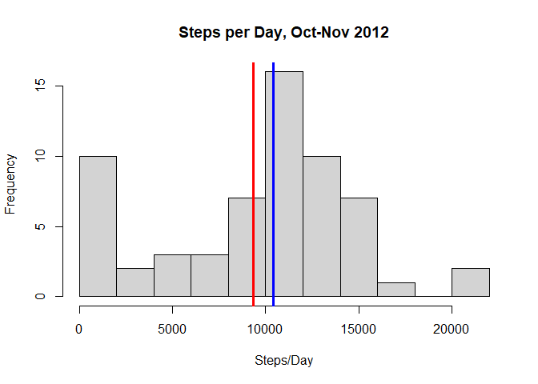
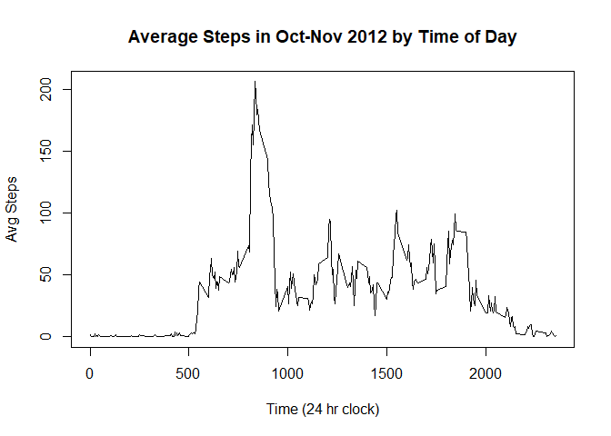
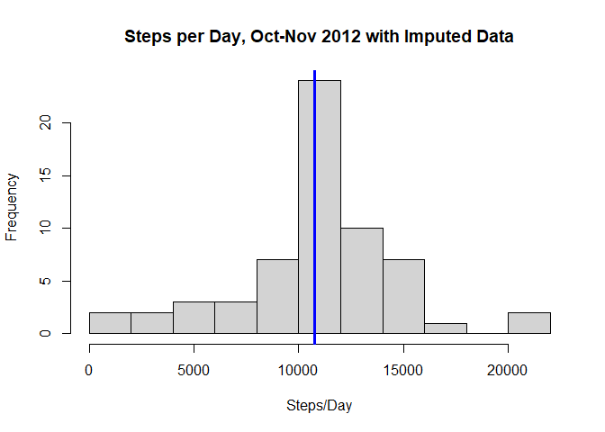
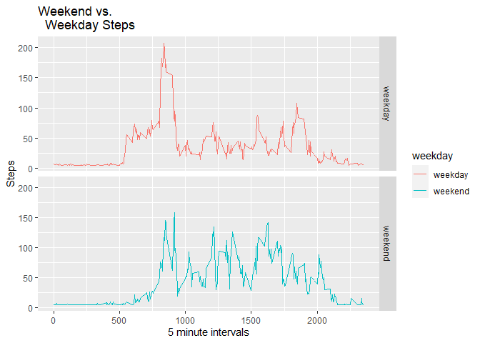

This is an exploratory analysis to examine data collected in October and November 2012 from a personal activity monitoring device. The data consist of one anonymous individual's step counts at five-minute intervals throughout the day.

For the initial analysis, I simply analyze existing data, excluding missing values, to attempt to find the mean total number of steps per day and the average daily pattern. Later in the analysis, I imputed missing values and attempted to identify differences between weekends and weekdays.

I used the knitr, tidyverse, and ggplot2 packages in processing, analyzing, and displaying the data.

```r
library(knitr)
library(tidyverse)
library(ggplot2)
```

## Loading and preprocessing the data

First, I downloaded and unzipped the data into my working folder. I downloaded the dataset I worked with from the URL below on 31 May 2021 at 15:27 GMT.

```r
#file download
fileUrl <- 'https://d396qusza40orc.cloudfront.net/repdata%2Fdata%2Factivity.zip'

if(!file.exists('./dlData')){
  dir.create('./dlData')
  download.file(url = fileUrl, destfile = './dlData/dlData.zip')
}

#unzips file if not done already
if(!file.exists('./extractedData')){
  dir.create('./extractedData')
  unzip('./dlData/dlData.zip', exdir = './extractedData')
}

#read csv
activityData <- read.csv('./extractedData/activity.csv', header = TRUE)
```

Initally, let's just take a look at the data.

```r
dim(activityData)
```

```
## [1] 17568     3
```

```r
head(activityData)
```

```
##   steps       date interval
## 1    NA 2012-10-01        0
## 2    NA 2012-10-01        5
## 3    NA 2012-10-01       10
## 4    NA 2012-10-01       15
## 5    NA 2012-10-01       20
## 6    NA 2012-10-01       25
```

Next, I preprocessed the data to make it easier to work with in my further analysis. First, I converted the date column into objects of the Date class.

```r
#convert dates to objects of date class
activityData$date <- as.Date(activityData$date, format = '%Y-%m-%d')
```

## What is mean total number of steps taken per day?

I summarize the data and take the sum of steps for each day, removing unknown values. The table itself is a jumble of numbers, so I summarize it in a histogram. I also mark the mean steps per day with a red line and median with a blue line.

```r
#process data to group by day
activityByDay <- group_by(activityData, date)

#sum steps by day
stepsByDay <- summarize(activityByDay, totalSteps = sum(steps, na.rm = TRUE))

#create histogram
hist(stepsByDay$totalSteps, breaks = 12, main = 'Steps per Day, Oct-Nov 2012',
    xlab = 'Steps/Day', ylab = 'Frequency')

#add lines
abline(v = mean(stepsByDay$totalSteps), col = 'red', lwd = 3)
abline(v = median(stepsByDay$totalSteps), col = 'blue', lwd = 3)
```

<!-- -->

The mean and median values of steps per day are displayed below.

```r
mean(stepsByDay$totalSteps)
```

```
## [1] 9354.23
```

```r
median(stepsByDay$totalSteps)
```

```
## [1] 10395
```

## What is the average daily activity pattern?
Now I am looking at the overall data for each five minute interval. First, I need to group the data by each interval rather than by date as in the previous example.

```r
#process data to group by interval
activityByInterval <- group_by(activityData, interval)
```

Then I take the mean of each five minute interval averaged across all days and save this for use in plotting. Again, I remove the unknown values. Then, I construct a time series plot to display the daily trend.

```r
#mean of each interval
StepsByInterval <- summarize(activityByInterval, avgSteps = mean(steps, na.rm = TRUE))

#construct time-series plot
plot(StepsByInterval$interval, StepsByInterval$avgSteps, type = 'l',
     main = 'Average Steps in Oct-Nov 2012 by Time of Day', xlab = 'Time (24 hr clock)',
     ylab = 'Avg Steps')
```

<!-- -->

When was our subject most active during the day? The code below breaks out the interval of higest activity.

```r
maxRow <- which.max(StepsByInterval$avgSteps)
StepsByInterval$interval[maxRow]
```

```
## [1] 835
```

Mr. or Ms. Anonymous took the most steps between 08:35 and 08:40 every day.

## Imputing missing values
How much data are we missing in the set? First, we calculate the total number of missing values.

```r
sum(is.na(activityData$steps))
```

```
## [1] 2304
```

We saw earlier that there were around 24000 observations - that means that almost 10% of the data is missing.

Now we replace the NAs with the mean value for all steps. The median for this dataset is 0, so it does not give us any meaningful data.


```r
#copy dataframe
activityDataImputed <- activityData

#replaces NAs with average value for given interval
activityDataImputed$steps <- replace_na(activityDataImputed$steps, 
   mean(activityData$steps, na.rm = TRUE))

#check our work, make sure no NAs remain
sum(is.na(activityDataImputed$steps))
```

```
## [1] 0
```

Now we go back to our first question and see how imputing some of the data changed our overall day-by-day steps. I expect it will increase some since we are effectively replacing some 0s with higher numbers.


```r
#process data to group by day
activityByDayImputed <- group_by(activityDataImputed, date)

#sum steps by day
stepsByDayImputed <- summarize(activityByDayImputed, totalSteps = sum(steps))

#create histogram
hist(stepsByDayImputed$totalSteps, breaks = 12, main = 'Steps per Day, Oct-Nov 2012 with Imputed Data',
    xlab = 'Steps/Day', ylab = 'Frequency')

#add lines
abline(v = mean(stepsByDayImputed$totalSteps), col = 'red', lwd = 3)
abline(v = median(stepsByDayImputed$totalSteps), col = 'blue', lwd = 3)
```

<!-- -->

And my expectation was correct. The mean and median both increased.

And the mean and median:

```r
mean(stepsByDayImputed$totalSteps)
```

```
## [1] 10766.19
```

```r
median(stepsByDayImputed$totalSteps)
```

```
## [1] 10766.19
```

## Are there differences in activity patterns between weekdays and weekends?

First we create a new factor variable with two levels, weekday and weekend.

```r
activityDataImputed$day <- as.factor(weekdays(activityDataImputed$date))
activityDataImputed$weekday <- as.factor(ifelse((activityDataImputed$day == 'Saturday'
  | activityDataImputed$day == 'Sunday'), 'weekend', 'weekday'))
head(activityDataImputed)
```

```
##     steps       date interval    day weekday
## 1 37.3826 2012-10-01        0 Monday weekday
## 2 37.3826 2012-10-01        5 Monday weekday
## 3 37.3826 2012-10-01       10 Monday weekday
## 4 37.3826 2012-10-01       15 Monday weekday
## 5 37.3826 2012-10-01       20 Monday weekday
## 6 37.3826 2012-10-01       25 Monday weekday
```

Then we make a plot comparing weekdays with weekends.

```r
ad_wd <- aggregate(steps ~ interval + weekday, activityDataImputed, mean)
ggplot(data = ad_wd, aes(color = weekday, x = interval, y = steps)) +
  geom_line() + labs(x = '5 minute intervals', y = 'Steps', title = 'Weekend vs.
  Weekday Steps') + facet_grid(weekday ~ .)
```

<!-- -->
